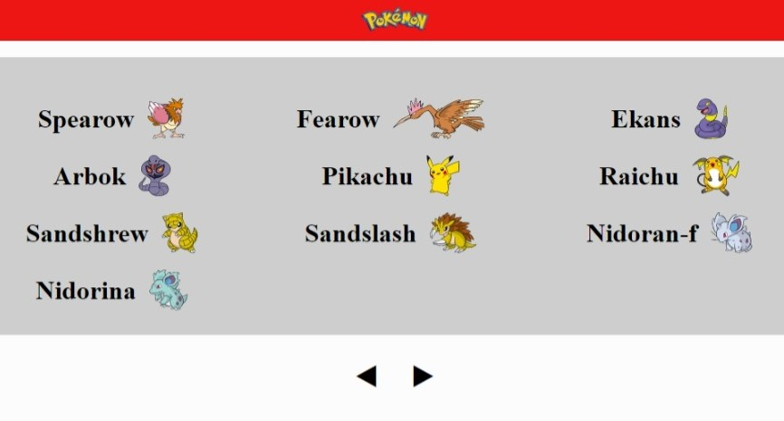
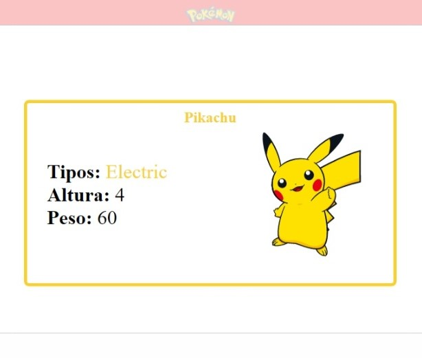

# React Pokemon Front

Esse projeto tem um intuito de ser um frontend para [pokeapi](https://pokeapi.co/)

## Como Roda a aplicação?

Clone o repositório e entre na pasta da aplicação

Utilize o comando `npm install` ou `yarn install` para instalar as dependências do projeto

Em seguida utilize `npm run start` ou `yarn start` para rodar a aplicação

Então a aplicação estará rodando em [http://localhost:3000](http://localhost:3000)

###### node deve esta instalado para utilizar o comando npm, yarn para yarn

## O que essa aplicação utiliza ?

Axios para fazer as requisições a api

Typescript para um melhor ambiente de desenvolvimento

React Modal Para a criação de modals

Css flexbox e @media screen para a responsividade

## O que essa aplicação faz ?

Consumindo a uma api [pokeapi](https://pokeapi.co/) ela mostra uma lista de pokemons

Ao clickar em pokemon um modal desse pokemon e aberto

